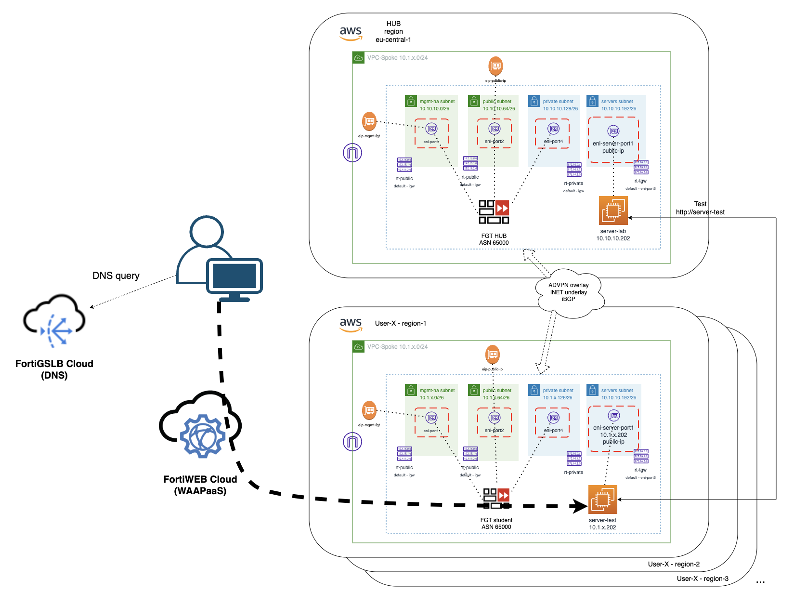

# Xpert Summit 2022
# Automation Cloud training
## Objetivo del laboratorio
El objetivo de este laboritorio es dar nociones sobre como desplegar una infraestructura relativamente compleja de hub y spoke en AWS. Además de dar idea de cómo poder operar un firewall Fortigate a través de su API. Durante el laboratio te familizaras con el entorno Terraform y como lanzar y customizar los despligues. 

El formato del laboratorio consiste en 4 entrenamiento diferenciados, que van desde el despliegue básico de un servidor de test y el Fortigate a realizar la configuración ADVPN para poder establecer conexión el HUB central, llamado Golden VPC. 

Los detalles necesarios para poder realizar el curso se encuentra en: 
http://xpertsummit22.jvigueras-fortinet-site.com

## Indice de laboratorios a completar
* T1_day0_deploy-vpc: despliegue del entorno básico en AWS
* T2_day0_deploy-server: despliegue del servidor de test en spoke
* T3_day0_deploy-fgt: despligue de Fortigate standalone en region AZ1
* T4_dayN_fgt-terraform: actualiación de configuraicón del Fortigate mediante Terraform

## Deployment Overview

## T1: [T1_day0_deploy-vpc](./T1_day0_deploy-vpc)
En este laboratorio T1, se desplegarán los siguientes recursos:
- Para el rango CIDR se usará el proporcionado a cada participante.
- 1 VPC con 4 subnets: Management, Public, Private y Servers
- Los Security Groups que se asociarán a cada una de las interfaces.
- 3 x network interfaces para el Fortigate.
- 1 x netwokr interface para el servidor de testeo.

## T2: [T2_day0_deploy-server](./T2_day0_deploy-server)
En este entrenamiento realizaremos lo siguiente:
- **IMPORTANTE** se debe haber completado con éxito el lab T1 
- Las variables necesarias para poder realizar el despliegue se actualizan con el anterior laboratorio T1_day0_deploy-pvc
- En este lab se realizará el despligue de un servidor en la subnet de servidores desplegada en la VPC
- El servidor de test se despliega con un servicio básico de servidor HTTP sobre el que servidor de la VPC estará lanzando las comprobaciones de conexión.

## T3: [T3_day0_deploy-fgt](./T3_day0_deploy-fgt)

En este entrenamiento realizaremos lo siguiente:
- **IMPORTANTE** se debe haber completado con éxito el laboratorio T1
- Las variables necesarias para poder realizar el despliegue de la IaC se recogen del entrenamiento T1
- En este lab se realizará el despligue de un Fortigate en la última versión disponible en el [AWS Marketplace](https://aws.amazon.com/marketplace/pp/prodview-wory773oau6wq?sr=0-1&ref_=beagle&applicationId=AWSMPContessa) en modo PAYG.
- El firewall se despliega con una configuración básica para poder acceder via https y también de forma programatica via API.
- El detalle necesario para poder acceder al fortigate se pueden obtener de la salida de Terraform cuando se realice.

## T4: [T4_dayN_fgt-terraform](./T4_dayN_fgt-terraform)

En este entrenamiento realizaremos lo siguiente:
- **IMPORTANTE** se debe haber completado con éxito el laboratorio: T1, T2 y T3
- Las variables necesarias para poder realizar el despliegue de la IaC se recogen de los anteriores entrenamientos.
- Los datos necesarios para poder desplegar la configuración en el equipo se cargan de manera automática.
- Este laboratios a su vez se devido en tres partes:
  - Configuración de túnel IPSEC entre el Fortigate spoke y el Fortigate de la VPC golden
  - Configuración de router BGP para compatización dinámica de rutas entre HUB y SPOKE
  - Configuración de policitas de seguridad para permitir el tráfico entre el serividor central y el servidor de test
- La idea del laboratorio es que se apliquen los cambios de configuración de manera progresiva, cambiando la extensión de los ficheros de Terraform para que cuenten para el plan de despliegue y comprobando como podriamos ir modificando la configuración del Fortigate a través de aquí.


## Diagram solution




# LAB
## Pasos a seguir:

## 1. Conexión al entorno de desarrollo Cloud9
- (Revisar detalle de pasos en laboratorio T1)

## 2. Clonar repositorio Git
- (Revisar detalle de pasos en laboratorio T1)

## 3.  Acceder a la carpeta del laboratorio correspondiente
- Abrir un nuevo terminal y entrar en la carpeta del laboratorio
```
cd T1_day0_deploy-vpc
```
- Desde el navegador de ficheros de la parte izquierda desplegando la carpeta correspondiente

## 4. **IMPORTANTE** Seguir las indicaciones del laboratorio T1
- Las variables necesarias para este laboratorio se completan en el laboratorio T1
- Las credendiales y resto de variables se importan desde el laboratorio T1 al resto
- Cambiar el nombre al fichero `terraform.tfvars.example` a `terraform.tfvars`

## 7. **Despligue** 
- (Seguir las indicaciones de cada laboratorio)

## 8. Comandos Terraform para despliegue

## Inicialización de providers y modulos:
  ```sh
  $ terraform init
  ```
* Crear un plan de despliegue y 
  ```sh
  $ terraform plan
  ```
* Comprobación que toda la configuración es correcta y no hay fallos.
* Desplegar el plan.
  ```sh
  $ terraform apply
  ```
* Confirmar despligue, type `yes`.


La salida incluye todo el detalle del despligue:
```sh
Outputs:
```


## Support
This a personal repository with goal of testing and demo Fortinet solutions on the Cloud. No support is provided and must be used by your own responsability. Cloud Providers will charge for this deployments, please take it in count before proceed.

## License
Based on Fortinet repositories with original [License](https://github.com/fortinet/fortigate-terraform-deploy/blob/master/LICENSE) © Fortinet Technologies. All rights reserved.


