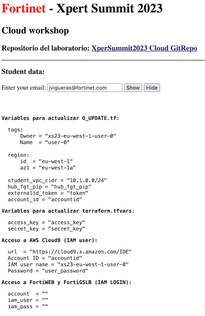
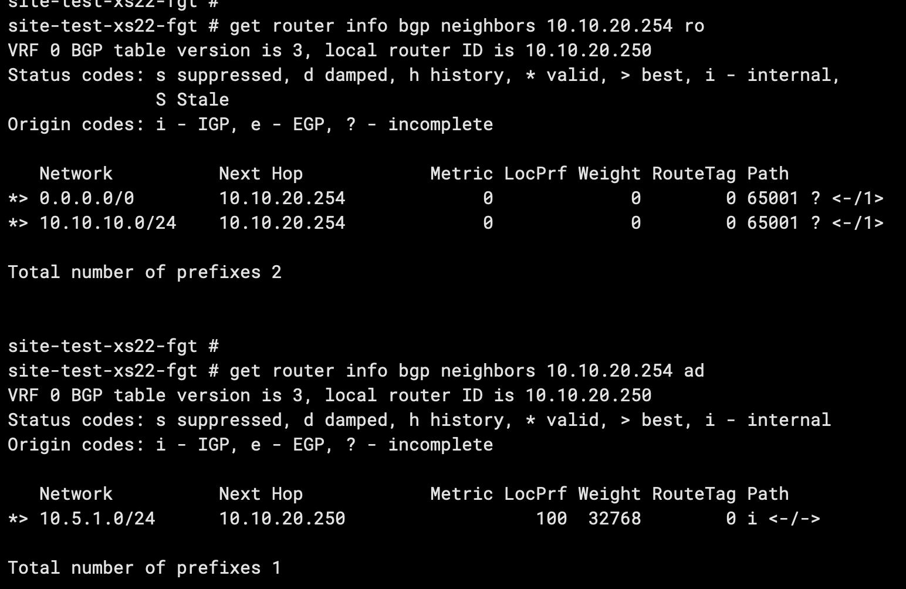

# Xpert Summit 2023
# NetDevOps, protección avanzada API y disponibilidad global
## Objetivo del laboratorio
El objetivo de este laboritorio es dar nociones sobre como desplegar una infraestructura relativamente compleja de hub y spoke en AWS. Además de dar idea de cómo poder operar un firewall Fortigate a través de su API. Durante el laboratio te familizaras con el entorno Terraform y como lanzar y customizar los despligues. 

Además, configurarás una nueva aplicación dentro del servicio de protección WAAP FortiWEB Cloud y realizarás pruebas de RedTeam contra la aplicación y verás como protegerla mediante Machine Learning.  

Por último, configurarás nuestro servicio de Global Service Load Balancing (GSLB) mediante DNS, FortiGSLB, para que los usuarios de la aplicación accedan a la misma siempre a su región más cercana. 

El formato del laboratorio consiste en 4 entrenamiento diferenciados y para poder realizarlos encontrarás todos los detalles en la siguiente URL, donde deberás introducir el token facilitado.

http://xs23.xpertsummit-es.com

## Indice de laboratorios a completar
* **T1_day0_IaC_vpc_fgt_server**: despliegue del entorno AWS
* T2_dayN_fgt_terraform: actualiación de configuraicón del Fortigate mediante Terraform
* T3_dayN_fortiweb: creación de una nueva aplicación y protección avanzada API
* T4_dayN_fortigslb: añadiremos la aplicación a un servicio de balanceo global DNS

## Lab T1. Resumen puesta en marcha

En este laboratorio se desplegarán los siguientes recursos:
- Los detalles parapoder desplegar se proporcionan para cada participante y son diferentes.
- En AWS se desplegará 1 VPC con 4 subnets: Management, Public, Private y Bastion
- Los Security Groups (SG) que se asociarán a cada una de las interfaces ya están definidos en el código.
- 1 x fortigate con los interfaces necesarios en cada subnet, sus SG asociados y la configuración SDWAN necesaria.
- 1 x servidor docker con una aplicación API de testeo.
- El código Terraform ya se proporicona en el laboratorio y se realizará mediante la llamada a tres modulos: uno crea la VPC, otro despliega el Fortigate y otro el servidor.   
- No es necesario tener instalado ninguna aplicación en el PC desde el que se realizará el laboratorio, más allá de un navegador web. 

## Diagrama del laboratorio


# LAB
## Pasos a seguir:

## 1. Conexión al entorno de desarrollo Cloud9
Desde el [portal formación](http://xs23.xpertsummit-es.com) puedes encontrar el detalle para acceder a tu IDE AWS Cloud9.

1.1 Obtener los datos de cada usuario:
- Desde el portal de formación introduce el email de registro al curso.
- Apareceran los datos asociados para usar durante el laboratorio.
- Acceder a la URL del portal Cloud9 que aparece con los datos de: `AWS Account ID`,  `IAM user` y `Password`. 



- Ejemplo:
  - URL acceso: https://eu-central-1.console.aws.amazon.com/cloud9/ide/d77xxxxx
  - AWS Account ID: xxxxxx
  - IAM user name: xs22-eu-west-1-user-1
  - Password: xxxxx


## 2. Clonar repositorio desde GitHub
- Abrir una nueva consola terminal o usar la actual.
- Desde el terminal ejecutar el siguiente comando: 
```
git clone https://github.com/xpertsummit/xpertsummit23.git
```
- ... o desde el botón de Git que se puede encontrar e introduciendo la URL anterior


## 3.  Acceder a la carpeta T1_day0_deploy-vpc
- Desde el terminal 
```
cd xpertsummit23/T1_day0_IaC_vpc_fgt_server/terraform
```
- Desde el navegador de ficheros de la parte izquierda desdplegando la carpeta corrspondiente al T1


## 4. **IMPORTANTE** Actualizar las variables locals necesarias para este primer laboratorio
- Las variables locals se deben actualizar con los datos únicos para cada participante.
- Los datos se deben de obtinen desde el [portal formación](http://xs23.xpertsummit-es.com) 
- Hacer doble click en el fichero **0_UPDATE.tf** desde el explorador de ficheros.
- Actualizar las siguientes variables con los datos de cada participante.
```sh
# UPDATE Owner and user with your AWS IAM user name
  tags = {
    Owner   = "xs23-eu-west-1-user-1" //update with your assigned user for access AWS console
    Name    = "user-1"                //update with your assigned user for access AWS console
    Project = "xs23"
  }

  # UPDATE Region and Availability Zone where deploy VPC and Subnets
  region = {
    "id"  = "eu-west-1"  //update with your assigned region
    "az1" = "eu-west-1a" //update with your assigned AZ
  }

  # UPDATE CIDR range with your assignation. (ex. VCP: 10.1.x.x group 1 - 10.1.1.0/24 user-1)
  student_vpc_cidr = "10.10.10.0/24"

  # UPDATE HUB SDWAN public IP and external token
  hub_fgt_pip      = "34.35.36.37"        //update with data showed in lab web
  externalid_token = "lab_token_provided" //update with lab token (this will be the VPN PSK)

  # AWS account_id
  account_id = "042579xxxxx"
```
**Recuerda guardar el fichero con los cambios realizados**

Nota: los rangos cidr están repartidos para cada participante y no se solpan, para lo que se ha seguido la siguiente nomenclatura:

 - 10.1.x.x asignado a la region west-1
 - 10.2.x.x asignado a la region west-2
 - ...
 - 10.1.0.0/24 asignado al user 0 en la region west-1
 - 10.2.1.0/24 asignado al user 1 en la region west-2
 - ...

## 5. **IMPORTANTE** - Actualizar las credenciales de acceso programático que usuará Terraform para el despliegue
- Hacer doble click en el fichero **terraform.tfvars.example** desde el explorador de ficheros.
- Actualizar las variables con los datos proporcionados en el [portal formación](http://xs23.xpertsummit-es.com) 
```
access_key          = "<AWS Access Key>"
secret_key          = "<AWS Secret Key>"
```
- Las variables deben quedar configuradas con el siguiente patrón: access_key="AZXSxxxxxx"
- Cambiar el nombre al fichero `terraform.tfvars.example` a `terraform.tfvars`

(Recuerda guardar el fichero con los cambios realizados)

## 6. **Despligue** 

* Inicialización de providers y modulos:
  ```sh
  $ terraform init
  ```
* Crear un plan de despliegue y 
  ```sh
  $ terraform plan
  ```
* Comprobación que toda la configuración es correcta y no hay fallos.
* Desplegar el plan.
  ```sh
  $ terraform apply
  ```
* Comprobar que se van a desplegar los recursos esperados en el plan.


* Confirmar despligue, type `yes`.


* Si todo funciona correctamente se generará una salida con el resumen del plan de despligue y las variables de output configuradas:


## 7. **Comprobar conectividad** 

7.1 Comprobación de conectividad a HUB y con servidor local
- Comprobación de la correcta conexión al HUB
```sh
get router info bgp summary
get router info routing-table bgp
get router info bgp neighbors 10.10.20.1 ad
get router info bgp neighbors 10.10.20.1 ro
```




- Conexión local contra el servidor (ejecutar desde consola Fortigate)
```sh
execute ping 10.x.x.202
execute telnet 10.x.x.202 80
diagnose sniffer packet any 'host 10.x.x.202' 4
```
Nota: recuerda que la IP de tu servidor depende de tu rango CIDR asignado: 
ej. 10.1.1.202 asignado al user 1 en la region west-1
ej. 10.2.5.202 asignado al user 5 en la region west-2

7.2 Comprobar que vuestro usuario ya aparece en la Leader Board del portal


## Laboratorio completado
Pasar a lab 2: [T2_dayN_fgt_terraform](https://github.com/xpertsummit/xpertsummit23/tree/main/T2_dayN_fgt_terraform)


## Support
This a personal repository with goal of testing and demo Fortinet solutions on the Cloud. No support is provided and must be used by your own responsability. Cloud Providers will charge for this deployments, please take it in count before proceed.

## License
Based on Fortinet repositories with original [License](https://github.com/fortinet/fortigate-terraform-deploy/blob/master/LICENSE) © Fortinet Technologies. All rights reserved.


