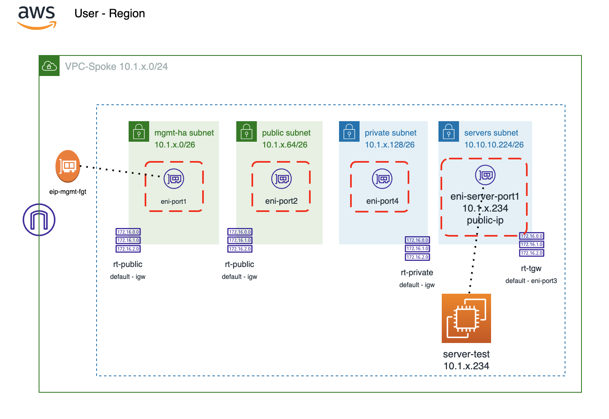
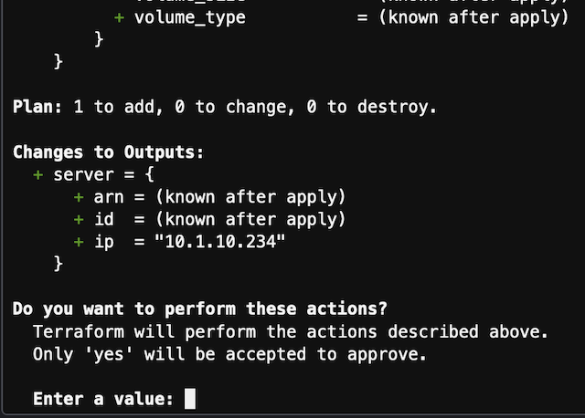
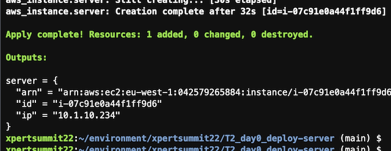

# Xpert Summit 2022
# Automation Cloud training
## Objetivo del laboratorio
El objetivo de este laboratorio es dar nociones sobre como desplegar una infraestructura relativamente compleja de hub y spoke en AWS. Además de dar idea de cómo poder operar un firewall Fortigate a través de su API. Durante el laboratorio te familiarizaras con el entorno Terraform y como lanzar y customizaz los despliegues. 

El formato del laboratorio consiste en 4 entrenamientos diferenciados, que van desde el despliegue básico de un servidor de test y el Fortigate a realizar la configuración ADVPN para poder establecer conexión el HUB central, llamado Golden VPC. 

Los detalles necesarios para poder realizar el curso se encuentra en: 
http://xpertsummit22.jvigueras-fortinet-site.com

## Indice de entramientos a completar
* T1_day0_deploy-vpc: despliegue del entorno básico en AWS
* **T2_day0_deploy-server**: despliegue del servidor de test en spoke
* T3_day0_deploy-fgt: despligue de Fortigate standalone en region AZ1
* T4_dayN_fgt-terraform: actualiación de configuraicón del Fortigate mediante Terraform

## Resumen puesta en marcha

En este entrenamiento realizaremos lo siguiente:
- **IMPORTANTE** se debe haber completado con éxito el lab T1.
- Las variables necesarias para poder realizar el despliegue se actualizan con el anterior laboratorio T1_day0_deploy-pvc.
- En este lab se realizará el despligue de un servidor en la subnet de servidores desplegada en la VPC.
- El servidor de test se despliega con un servicio HTTP.


## Diagram solution




# LAB
## Pasos a seguir:

## 1. Conexión al entorno de desarrollo Cloud9
- (Revisar pasos laboratorio T1)

## 2.  Acceder a la carpeta T2_day0_deploy-server
- Abrir un nuevo terminal y entrar en la carpeta del laboratorio
```
cd T2_day0_deploy-server
```
- Desde el navegador de ficheros de la parte izquierda desdplegando la carpeta corrspondiente al T2

## 4. **IMPORTANTE** - Debes haber completado con éxito el laboratorio T1 para continuar
- Las variables necesarias para este laboratorio se importan del anterior y se recogen el el fichero `locals.tf`
- Las credendiales programáticas ACCESS_KEY y SECRET_KEY también se importan del lab anterior.
- (En este laboratorio NO es necesario el fichero `terraform.tfvars`)


## 6. **Despligue** 

* Inicialización de providers y modulos:
  ```sh
  $ terraform init
  ```
* Crear un plan de despliegue y 
  ```sh
  $ terraform plan
  ```
* Comprobación que toda la configuración es correcta y no hay fallos.
* Desplegar el plan.
  ```sh
  $ terraform apply
  ```
* Confirmar despligue, type `yes`.



Al final del despliegue tendremos una salida similar a esta



## Laboratorio completado
Pasar a lab 3: [T3_day0_deploy-fgt](https://github.com/jmvigueras/xpertsummit22/tree/main/T3_day0_deploy-fgt)


## Support
This a personal repository with goal of testing and demo Fortinet solutions on the Cloud. No support is provided and must be used by your own responsability. Cloud Providers will charge for this deployments, please take it in count before proceed.

## License
Based on Fortinet repositories with original [License](https://github.com/fortinet/fortigate-terraform-deploy/blob/master/LICENSE) © Fortinet Technologies. All rights reserved.


