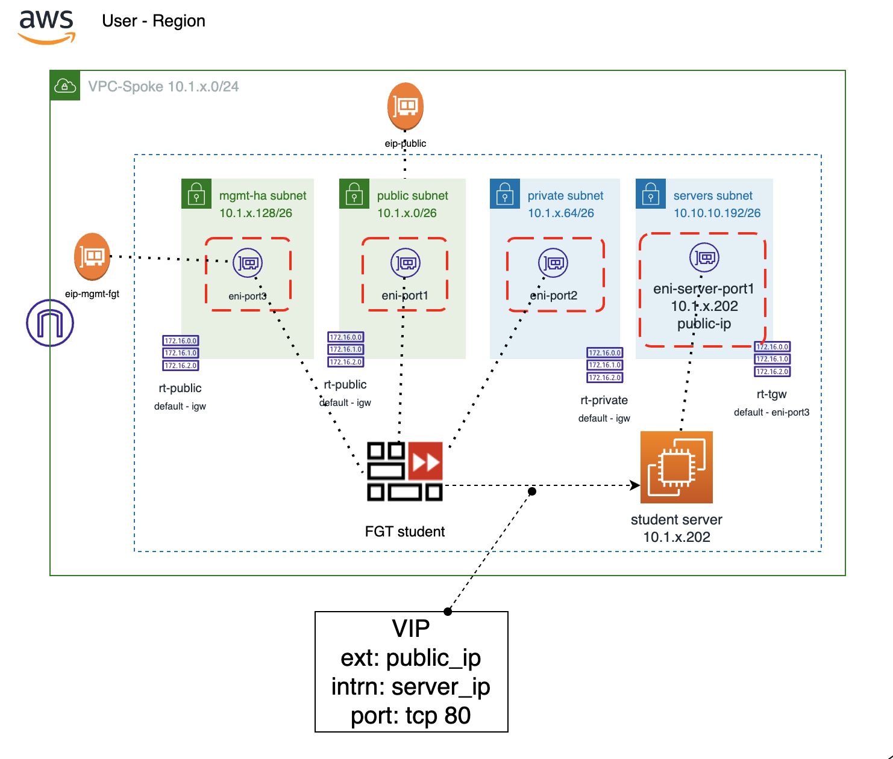
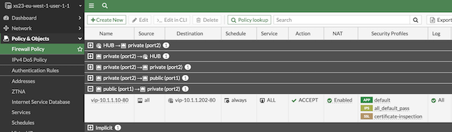
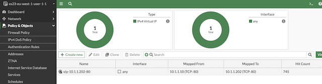
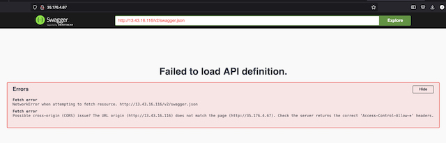

# Xpert Summit 2023
# NetDevOps, protección avanzada API y disponibilidad global
## Objetivo del laboratorio
El objetivo de este laboritorio es dar nociones sobre como desplegar una infraestructura relativamente compleja de hub y spoke en AWS. Además de dar idea de cómo poder operar un firewall Fortigate a través de su API. Durante el laboratio te familizaras con el entorno Terraform y como lanzar y customizar los despligues. 

Además, configurarás una nueva aplicación dentro del servicio de protección WAAP FortiWEB Cloud y realizarás pruebas de RedTeam contra la aplicación y verás como protegerla mediante Machine Learning.  

Por último, configurarás nuestro servicio de Global Service Load Balancing (GSLB) mediante DNS, FortiGSLB, para que los usuarios de la aplicación accedan a la misma siempre a su región más cercana. 

El formato del laboratorio consiste en 4 entrenamiento diferenciados y para poder realizarlos encontrarás todos los detalles en la siguiente URL, donde deberás introducir el token facilitado.

http://xs23.xpertsummit-es.com

## Indice de laboratorios a completar
* T1_day0_IaC_vpc_fgt_server: despliegue del entorno AWS
* **T2_dayN_fgt_terraform**: actualiación de configuraicón del Fortigate mediante Terraform
* T3_dayN_fortiweb: creación de una nueva aplicación y protección avanzada API
* T4_dayN_fortigslb: añadiremos la aplicación a un servicio de balanceo global DNS

## Lab T2. Resumen puesta en marcha

En este laboratorio realizaremos lo siguiente:
- **IMPORTANTE** se debe haber completado con éxito el laboratorio: T1
- Los datos necesarios para poder desplegar la configuración en el fortigate via programatica, se cargan de manera automática del anterior laboratorio. 
- La idea del laboratorio es que se apliquen los cambios de configuración necesarios, via Terraform FortiOS provider, contra el Fortigate desplegado en el laboratorio anterior para crear una nueva VIP contra el servidor interno.


## Diagrama del laboratorio




# LAB
## Pasos a seguir:

## 1. Conexión al entorno de desarrollo Cloud9
- (Revisar pasos laboratorio T1)

## 2.  Acceder a la carpeta T2_dayN_fgt-terraform
- Abrir un nuevo terminal y entrar en la carpeta del laboratorio
```
cd T2_dayN_fgt_terraform/terraform
```
- Desde el navegador de ficheros de la parte izquierda desplegando la carpeta correspondiente al T2

## 3. **IMPORTANTE** - completar con éxito el laboratorio T1 para continuar
- En ete laboratorio NO son necesarias Las credendiales progrmáticas ACCESS_KEY y SECRET_KEY, ya que el provider a usar es fortios, revisar fichero `provider.tf`
- En este laboratorio NO es necesario el fichero `terraform.tfvars` dado que las variables sensibles se cargan del anterior laboratorio.
- Los datos de IP pública de management del fortigate y el puerto de gestión se recogen del anterior laboratorio, así como el API token.
- Dado que las variables necesarias ya las tenemos del anterior laboratorio NO es necesario configurar ninguna de ellas. Revisar `main.tf` para profundizar.

<details><summary>main.tf</summary>
<p>

```sh
# File main.tf
locals {
  // Create locals from T1_day0 trainnnig terraform output
  student_fgt    = data.terraform_remote_state.T1_day0.outputs.student_fgt
  student_server = data.terraform_remote_state.T1_day0.outputs.student_server
}
# File provider.tf
provider "fortios" {
  hostname = "${local.student_fgt["mgmt_ip"]}:${local.student_fgt["admin_port"]}"
  token    = local.student_fgt["api_key"]
  insecure = "true"
}
```
</p>
</details>

## 4. **Despliegue** 

* Inicialización de providers y modulos:
  ```sh
  $ terraform init
  ```
* Crear un plan de despliegue y 
  ```sh
  $ terraform plan
  ```
* Comprobación que toda la configuración es correcta y no hay fallos.
* Desplegar el plan.
  ```sh
  $ terraform apply
  ```
* Comprobar que se van a desplegar los recursos esperados en el plan.


## 5. **Comprobación**

* Comprobación de la creación de la nueva VIP y la política de seguridad asociada desde el fortigate. 





* Acceso web a la IP pública del fortigate por el puerto 80 y ver si se muestra la aplicación del servidor interno.

**Nota: la aplicación se ha desplegado para que responda a una URL en concreto: http://{Owner}.xpertsummit-es.com, por eso es normal que al conectar direcatamente a través de la IP del servidor aparezca un error o se quede cargando. Si el servidor está accesible y responde todo funciona como se espera.**



## Laboratorio completado

Pasar a lab 3: [T3_dayN_fortiweb](https://github.com/xpertsummit/xpertsummit23/tree/main/T3_dayN_fortiweb)

## Support
This a personal repository with goal of testing and demo Fortinet solutions on the Cloud. No support is provided and must be used by your own responsability. Cloud Providers will charge for this deployments, please take it in count before proceed.

## License
Based on Fortinet repositories with original [License](https://github.com/fortinet/fortigate-terraform-deploy/blob/master/LICENSE) © Fortinet Technologies. All rights reserved.


