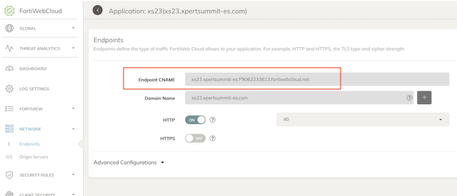

# Xpert Summit 2023
# NetDevOps, protección avanzada API y disponibilidad global
## Objetivo del laboratorio
El objetivo de este laboritorio es dar nociones sobre como desplegar una infraestructura relativamente compleja de hub y spoke en AWS. Además de dar idea de cómo poder operar un firewall Fortigate a través de su API. Durante el laboratio te familizaras con el entorno Terraform y como lanzar y customizar los despligues. 

Además, configurarás una nueva aplicación dentro del servicio de protección WAAP FortiWEB Cloud y realizarás pruebas de RedTeam contra la aplicación y verás como protegerla mediante Machine Learning.  

Por último, configuraras nuestro servicio de Global Service Load Balancing (GSLB) mediante DNS, FortiGSLB, para que los usuarios de la aplicación accedan a la misma siempre a su región más cercana. 

El formato del laboratorio consiste en 4 entrenamiento diferenciados y para poder realizarlos encontrarás todos los detalles en la siguiente URL, donde deberás introducir el token facilitado.

http://labserver.xpertsummit-es.com

## Indice de laboratorios a completar
* T1_day0_IaC_vpc_fgt_server: despliegue del entorno AWS
* T2_dayN_fgt_terraform: actualiación de configuraicón del Fortigate mediante Terraform
* **T3_dayN_fortiweb**: creación de una nueva aplicación y protección avanzada API
* T4_dayN_fortigslb: añadiremos la aplicación a un servicio de balanceo global DNS

## Lab T3. Resumen puesta en marcha

En este laboratorio realizaremos lo siguiente:
- **IMPORTANTE** se debe haber completado con éxito el laboratorio T2
- Creación de una nueva aplicación protegida mediante FortiWEB cloud que tenga como servidor de origen el nuevo servicio publicado en nuestro fortigate mediante VIP y por tanto, al servidor final del laboratorio. (Completar [T2_dayN_fgt_terraform](./T2_dayN_fgt_terraform) sino se ha realizado ya)
- Lanzaremos pruebas de carga contra FortiWEB para que aprenda los patrones de tráfico de la aplicación y pueda aplicar protección avanzada no basada en firmas, mediante ML.
- Ejercicios de RedTeam para probar la eficacia de la protección.

## Diagrama del laboratorio


# LAB
## Pasos a seguir:

## 1. Conexión al portal de Fortiweb Cloud
- Los datos de acceso se proporcionan en el portal del laboratorio: `account`, `user`y `password`. 


## 2.  Acceder a la carpeta T4_dayN_fgt-terraform
- Abrir un nuevo terminal y entrar en la carpeta del laboratorio
```
cd T4_dayN_fgt-terraform
```
- Desde el navegador de ficheros de la parte izquierda desplegando la carpeta correspondiente al T4

## 3. **IMPORTANTE** - completar con éxito el laboratorio T1 al T3 para continuar
- En ete laboratorio NO son necesarias Las credendiales progrmáticas ACCESS_KEY y SECRET_KEY, ya que el provider a usar es fortios, revisar fichero `provider.tf`
- En este laboratorio NO es necesario el fichero `terraform.tfvars`
- Es necesario actualizar el fichero de variables `vars.tf` con los datos del HUB (**recordatorio** el dato de hub_fgt_pip se encuentra en el [portal](http://xpertsummit22.jvigueras-fortinet-site.com/))

(Recordar siempre guardar el fichero tras los cambios)

```sh
variable "vpc-golden_hub" {
  type = map(any)
  default = {
    "bgp_asn"        = "65001"          // BGP ASN HUB central (golden VPC)
    "advpn_pip"      = "<hub_fgt_pip>"  // Update with public IP Golden HUB
    "advpn_net"      = "10.10.20.0/24"  // Internal CIDR range for ADVPN tunnels private
    "sla_hck_ip"     = "10.10.40.10"    // (FUTURE USE) Not necessary in this lab
  }
}
```

## 4. **Despliegue** 

4.1 Creación de nuevo túnel IPSEC ADVPN contra el HUB central
- Cambiamos el nombre del fichero `1_ipsec-to-golden.tf.example` a `1_ipsec-to-golden.tf`
- Inicializamos el proceso de despliegue (revisar punto 8)
- Comprobar desde la GUI del Fortigate el correcto despliegue del túnel IPSEC



4.2 Configuración de router BGP
- Cambiamos el nombre del fichero `2_bgp-route.tf.example` a `2_bgp-route.tf`
- Inicializamos el proceso de despliegue (revisar punto 8)
- Comprobaremos que no va a realizar ningún cambio sobre la configuración anterior que hemos desplegado
- Comprobar desde la GUI del Fortigate el correcto despliegue

```sh
user-1-fgt # show router bgp
config router bgp
    set as 65011
    set keepalive-timer 10
    set holdtime-timer 3
    config neighbor
        edit "10.10.20.254"
            set remote-as 65001
        next
    end
    config network
        edit 1
            set prefix 10.1.1.0 255.255.255.0
        next
    end
```

4.3 Configuración de política de seguridad
- Cambiamos el nombre del fichero `3_policy-to-server.tf.example` a `3_policy-to-server.tf`
- Inicializamos el proceso de despliegue (revisar punto 8)
- Comprobaremos que no va a realizar ningún cambio sobre la configuración anterior que hemos desplegado
- Comprobar desde la GUI del Fortigate el correcto despliegue


- Comprobación que ahora la VPN aparece levantada


4.4 Configuración de ruta estática
- Revisar la documentación de [Terraform FortiOS Provider](https://registry.terraform.io/providers/fortinetdev/fortios/latest/docs) y buscar el resource correspondiente a "fortios_router_static"
- Completar el fichero `4_static-route.tf` para generar una nueva ruta estática:
  - La ruta estática tendrá como destino la propia red del spoke (datos para el lab vpc_cidr)
  - El puerto destino será "port3"
  - El GW destino será la primera dirección IP del rango asignado al puerto 3: 10.x.x.129

<details><summary>Help</summary>
<p>

```sh
resource "fortios_router_static" "trname" {
  device              = "port3"
  dst                 = "10.x.x.0 255.255.255.0"
  gateway             = "10.x.x.129"
  status              = "enable"
}
```
</p>
</details>

- Inicializamos el proceso de despliegue (revisar punto 8)
- Comprobaremos que no va a realizar ningún cambio sobre la configuración anterior que hemos desplegado
- Comprobar desde la GUI del Fortigate el correcto despliegue


4.5 Comprobación de conectividad a HUB y con servidor local
- Comprobación de la correcta conexión al HUB (Golden VPC)
```sh
get router info bgp summary
get router info routing-table bgp
get router info bgp neighbors 10.10.20.254 ad
get router info bgp neighbors 10.10.20.254 ro
```


- Conexión local contra el servidor (ejecutar desde consola Fortigate)
```sh
execute ping 10.x.x.234
execute telnet 10.x.x.234 80
diagnose sniffer packet any '10.x.x.234' 4
```

## Laboratorio completado

## 5. Comandos Terraform para despliegue

## Inicialización de providers y modulos:
  ```sh
  $ terraform init
  ```
* Crear un plan de despliegue y 
  ```sh
  $ terraform plan
  ```
* Comprobación que toda la configuración es correcta y no hay fallos.
* Desplegar el plan.
  ```sh
  $ terraform apply
  ```
* Confirmar despliegue, type `yes`.


La comprobación de despliegue se debe realizar desde la GUI del Fortigate.
```sh
Outputs:
```

## Support
This a personal repository with goal of testing and demo Fortinet solutions on the Cloud. No support is provided and must be used by your own responsability. Cloud Providers will charge for this deployments, please take it in count before proceed.

## License
Based on Fortinet repositories with original [License](https://github.com/fortinet/fortigate-terraform-deploy/blob/master/LICENSE) © Fortinet Technologies. All rights reserved.


