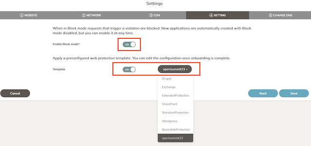

# Xpert Summit 2023
# NetDevOps, protección avanzada API y disponibilidad global
## Objetivo del laboratorio
El objetivo de este laboritorio es dar nociones sobre como desplegar una infraestructura relativamente compleja de hub y spoke en AWS. Además de dar idea de cómo poder operar un firewall Fortigate a través de su API. Durante el laboratio te familizaras con el entorno Terraform y como lanzar y customizar los despligues. 

Además, configurarás una nueva aplicación dentro del servicio de protección WAAP FortiWEB Cloud y realizarás pruebas de RedTeam contra la aplicación y verás como protegerla mediante Machine Learning.  

Por último, configuraras nuestro servicio de Global Service Load Balancing (GSLB) mediante DNS, FortiGSLB, para que los usuarios de la aplicación accedan a la misma siempre a su región más cercana. 

El formato del laboratorio consiste en 4 entrenamiento diferenciados y para poder realizarlos encontrarás todos los detalles en la siguiente URL, donde deberás introducir el token facilitado.

http://labserver.xpertsummit-es.com

## Indice de laboratorios a completar
* T1_day0_IaC_vpc_fgt_server: despliegue del entorno AWS
* T2_dayN_fgt_terraform: actualiación de configuraicón del Fortigate mediante Terraform
* **T3_dayN_fortiweb**: creación de una nueva aplicación y protección avanzada API
* T4_dayN_fortigslb: añadiremos la aplicación a un servicio de balanceo global DNS

## Lab T3. Resumen puesta en marcha

En este laboratorio realizaremos lo siguiente:
- **IMPORTANTE** se debe haber completado con éxito el laboratorio T2
- Creación de una nueva aplicación protegida mediante FortiWEB cloud que tenga como servidor de origen el nuevo servicio publicado en nuestro fortigate mediante VIP y por tanto, al servidor final del laboratorio. (Completar [T2_dayN_fgt_terraform](./T2_dayN_fgt_terraform) sino se ha realizado ya)
- Lanzaremos pruebas de carga contra FortiWEB para que aprenda los patrones de tráfico de la aplicación y pueda aplicar protección avanzada no basada en firmas, mediante ML.
- Ejercicios de RedTeam para probar la eficacia de la protección.

## Diagrama del laboratorio

# LAB
## Pasos a seguir:

## 1. Conexión al servicio de FortiWEB Cloud
- En el portal de laboratorio, se ha asigando a cada participante una credencial de FortiCloud.

- Con esas credenciales acceder al servicio SaaS de FortiGSLB en la url [FortiWEB Cloud](https://www.fortiweb-cloud.com/)

## 2. Creación de una nueva aplicación
- La creación de una nueva aplicación en FortiWEB Cloud es bastante sencilla. En este laboratorio realizaremos el alta via GUI en el portal, pero se puede automatizar realizando peticiones a la API del servicio. [FortiWEB Cloud API reference](https://www.fortiweb-cloud.com/apidoc/api.html)
- En el menú de la izquierda seleccionaremos `Global > Applications`

- Dentro de la sección aplicaciones, clicaremos en `ADD APPLICATION` para arrancar el wizard de alta. 

- Wizard step 1: Nombre de applicación y dominio
    * Web Application Name: `Owner`-app
    * Domain Name: `Owner`.xpertsummit-es.com

- Wizard step 2: Protocolo, puertos e IP origen del servidor
    * services allowed: HTTP
    * IP Address or FQDN: (IP pública de servicio Fortigate)
    * Port: 80
    * Test Server: (comprobar conexión al servidor usando HTTP)

- Wizard step 3: Habilitar CDN
    * services allowed: (NO habilitamos servicios de CDN)

- Wizard step 4: Habilitar modo bloqueo y template
    * Enable Block mode: (le dajamos en detección OFF)
    * Template: `xpertsummit22` (selecionamos este template en el desplegable)

- Completado: 
    * El resultado es el nuevo CNAME de nuestra applicación para acceder desde FortiWEB Cloud y poder actualizar nuestros servidores DNS.
    * Desde el nuevo fqdn podremos acceder a nuestra aplicación a través de FortiWEB Cloud.

- En el menú general de aplicaciones podremos ver cómo FortiWEB Cloud de forma automática ha desplegado una instancia de FortiWEB en el Datacenter más cercano a la aplicación. 

FortiWEB Cloud despliega instancias cercanas a la aplicación de manera automatica, siendo los principales Datacenters AWS, Azure, GCP y OCI. 

## Support
This a personal repository with goal of testing and demo Fortinet solutions on the Cloud. No support is provided and must be used by your own responsability. Cloud Providers will charge for this deployments, please take it in count before proceed.

## License
Based on Fortinet repositories with original [License](https://github.com/fortinet/fortigate-terraform-deploy/blob/master/LICENSE) © Fortinet Technologies. All rights reserved.

