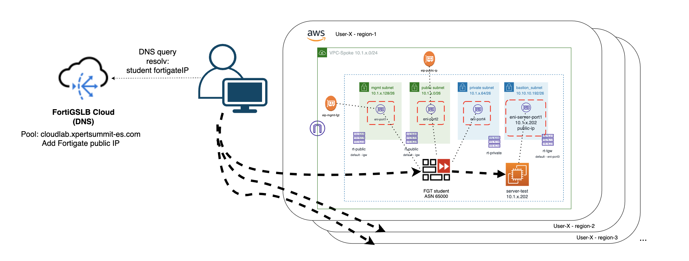
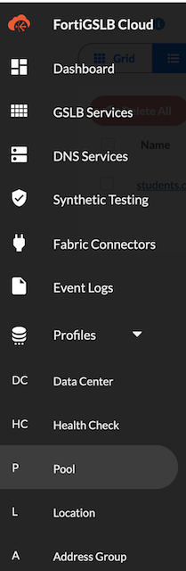
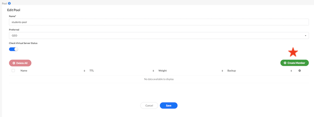

# Xpert Summit 2022
# Automation Cloud training
## Objetivo del laboratorio
El objetivo de este laboratorio es dar nociones sobre como desplegar una infraestructura relativamente compleja de hub y spoke en AWS. Además de dar idea de cómo poder operar un firewall Fortigate a través de su API. Durante el laboratorio te familiarizaras con el entorno Terraform y como lanzar y customizaz los despliegues. 

El formato del laboratorio consiste en 4 entrenamientos diferenciados, que van desde el despliegue básico de un servidor de test y el Fortigate a realizar la configuración ADVPN para poder establecer conexión el HUB central, llamado Golden VPC.

Los detalles necesarios para poder realizar el curso se encuentra en: 
http://xpertsummit22.jvigueras-fortinet-site.com

## Indice de laboratorios a completar:
* T1_day0_deploy-vpc: despliegue del entorno básico en AWS
* T2_day0_deploy-server: despliegue del servidor de test en spoke
* T3_day0_deploy-fgt: despliegue de Fortigate standalone en region AZ1
* **T4_dayN_fgt-terraform**: actualización de configuración del Fortigate mediante Terraform

## Deployment Overview

En este entrenamiento realizaremos lo siguiente:
- **IMPORTANTE** se debe haber completado con éxito el laboratorio: T1, T2 y T3
- Las variables necesarias para poder realizar el despliegue de la IaC se recogen de los anteriores entrenamientos.
- Los datos necesarios para poder desplegar la configuración en el equipo se cargan de manera automática.
- Este laboratorio a su vez se divide en tres partes:
  - Configuración de túnel IPSEC entre el Fortigate spoke y el Fortigate de la VPC golden
  - Configuración de router BGP para aprendizaje dinámico de rutas entre HUB y SPOKE
  - Configuración de polítcias de seguridad para permitir el tráfico entre el serividor central y el servidor de test
- La idea del laboratorio es que se apliquen los cambios de configuración de manera progresiva, cambiando la extensión de los ficheros de Terraform para que cuenten para el plan de despliegue y comprobando como podriamos ir modificando la configuración del Fortigate a través de aquí.


## Diagram solution




# LAB
## Pasos a seguir:

## 1. Conexión al entorno de desarrollo Cloud9
- (Revisar pasos laboratorio T1)

## 2.  Acceder a la carpeta T4_dayN_fgt-terraform
- Abrir un nuevo terminal y entrar en la carpeta del laboratorio
```
cd T4_dayN_fgt-terraform
```
- Desde el navegador de ficheros de la parte izquierda desplegando la carpeta correspondiente al T4

## 3. **IMPORTANTE** - completar con éxito el laboratorio T1 al T3 para continuar
- En ete laboratorio NO son necesarias Las credendiales progrmáticas ACCESS_KEY y SECRET_KEY, ya que el provider a usar es fortios, revisar fichero `provider.tf`
- En este laboratorio NO es necesario el fichero `terraform.tfvars`
- Es necesario actualizar el fichero de variables `vars.tf` con los datos del HUB (**recordatorio** el dato de hub_fgt_pip se encuentra en el [portal](http://xpertsummit22.jvigueras-fortinet-site.com/))

(Recordar siempre guardar el fichero tras los cambios)

```sh
variable "vpc-golden_hub" {
  type = map(any)
  default = {
    "bgp_asn"        = "65001"          // BGP ASN HUB central (golden VPC)
    "advpn_pip"      = "<hub_fgt_pip>"  // Update with public IP Golden HUB
    "advpn_net"      = "10.10.20.0/24"  // Internal CIDR range for ADVPN tunnels private
    "sla_hck_ip"     = "10.10.40.10"    // (FUTURE USE) Not necessary in this lab
  }
}
```

## 4. **Despliegue** 

4.1 Creación de nuevo túnel IPSEC ADVPN contra el HUB central
- Cambiamos el nombre del fichero `1_ipsec-to-golden.tf.example` a `1_ipsec-to-golden.tf`
- Inicializamos el proceso de despliegue (revisar punto 8)
- Comprobar desde la GUI del Fortigate el correcto despliegue del túnel IPSEC



4.2 Configuración de router BGP
- Cambiamos el nombre del fichero `2_bgp-route.tf.example` a `2_bgp-route.tf`
- Inicializamos el proceso de despliegue (revisar punto 8)
- Comprobaremos que no va a realizar ningún cambio sobre la configuración anterior que hemos desplegado
- Comprobar desde la GUI del Fortigate el correcto despliegue

```sh
user-1-fgt # show router bgp
config router bgp
    set as 65011
    set keepalive-timer 10
    set holdtime-timer 3
    config neighbor
        edit "10.10.20.254"
            set remote-as 65001
        next
    end
    config network
        edit 1
            set prefix 10.1.1.0 255.255.255.0
        next
    end
```

4.3 Configuración de política de seguridad
- Cambiamos el nombre del fichero `3_policy-to-server.tf.example` a `3_policy-to-server.tf`
- Inicializamos el proceso de despliegue (revisar punto 8)
- Comprobaremos que no va a realizar ningún cambio sobre la configuración anterior que hemos desplegado
- Comprobar desde la GUI del Fortigate el correcto despliegue



- Comprobación que ahora la VPN aparece levantada


4.4 Configuración de ruta estática
- Revisar la documentación de [Terraform FortiOS Provider](https://registry.terraform.io/providers/fortinetdev/fortios/latest/docs) y buscar el resource correspondiente a "fortios_router_static"
- Completar el fichero `4_static-route.tf` para generar una nueva ruta estática:
  - La ruta estática tendrá como destino la propia red del spoke (datos para el lab vpc_cidr)
  - El puerto destino será "port3"
  - El GW destino será la primera dirección IP del rango asignado al puerto 3: 10.x.x.129

<details><summary>Help</summary>
<p>

```sh
resource "fortios_router_static" "trname" {
  device              = "port3"
  dst                 = "10.x.x.0 255.255.255.0"
  gateway             = "10.x.x.129"
  status              = "enable"
}
```
</p>
</details>

- Inicializamos el proceso de despliegue (revisar punto 8)
- Comprobaremos que no va a realizar ningún cambio sobre la configuración anterior que hemos desplegado
- Comprobar desde la GUI del Fortigate el correcto despliegue


4.5 Comprobación de conectividad a HUB y con servidor local
- Comprobación de la correcta conexión al HUB (Golden VPC)
```sh
get router info bgp summary
get router info routing-table bgp
get router info bgp neighbors 10.10.20.254 ad
get router info bgp neighbors 10.10.20.254 ro
```


- Conexión local contra el servidor (ejecutar desde consola Fortigate)
```sh
execute ping 10.x.x.234
execute telnet 10.x.x.234 80
diagnose sniffer packet any '10.x.x.234' 4
```

## Laboratorio completado

## 5. Comandos Terraform para despliegue

## Inicialización de providers y modulos:
  ```sh
  $ terraform init
  ```
* Crear un plan de despliegue y 
  ```sh
  $ terraform plan
  ```
* Comprobación que toda la configuración es correcta y no hay fallos.
* Desplegar el plan.
  ```sh
  $ terraform apply
  ```
* Confirmar despliegue, type `yes`.


La comprobación de despliegue se debe realizar desde la GUI del Fortigate.
```sh
Outputs:
```

## Support
This a personal repository with goal of testing and demo Fortinet solutions on the Cloud. No support is provided and must be used by your own responsability. Cloud Providers will charge for this deployments, please take it in count before proceed.

## License
Based on Fortinet repositories with original [License](https://github.com/fortinet/fortigate-terraform-deploy/blob/master/LICENSE) © Fortinet Technologies. All rights reserved.


