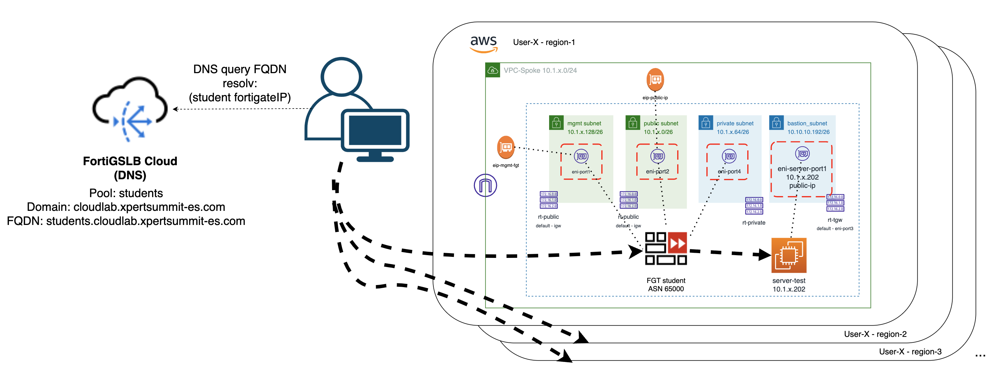
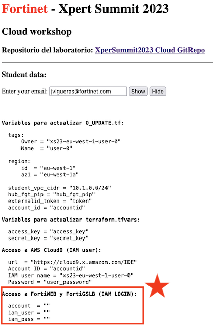

# Xpert Summit 2023
# NetDevOps, protección avanzada API y disponibilidad global
## Objetivo del laboratorio
El objetivo de este laboratorio es dar nociones sobre cómo desplegar una infraestructura relativamente compleja de hub y spoke en AWS. Además de dar idea de cómo poder operar un firewall Fortigate a través de su API. Durante el laboratorio te familizarás con el entorno Terraform y cómo lanzar y customizar los despliegues.

Además, configurarás una nueva aplicación dentro del servicio de protección WAAP FortiWEB Cloud y realizarás pruebas de RedTeam contra la aplicación y verás como protegerla mediante Machine Learning.  

Por último, configurarás nuestro servicio de Global Service Load Balancing (GSLB) mediante DNS, FortiGSLB, para que los usuarios de la aplicación accedan a la misma siempre a su región más cercana. 

El formato del laboratorio consiste en 4 entrenamientos diferenciados y para poder realizarlos encontrarás todos los detalles en la siguiente URL, donde deberás introducir el token facilitado.

http://xs23.xpertsummit-es.com

## Indice de laboratorios a completar
* T1_day0_IaC_vpc_fgt_server: despliegue del entorno AWS
* T2_dayN_fgt_terraform: actualización de configuración del Fortigate mediante Terraform
* T3_dayN_fortiweb: creación de una nueva aplicación y protección avanzada API
* **T4_dayN_fortigslb**: añadiremos la aplicación a un servicio de balanceo global DNS

## Lab T4. Resumen puesta en marcha

En este entrenamiento realizaremos lo siguiente:
- **IMPORTANTE** se debe haber completado con éxito el laboratorio: T2
- Añadir nuestro servidor al servicio GSLB ya configurado en FortiGLB.
- Comprobación que el servicio añade a la resolución DNS de la aplicación nuestra IP.


## Diagram solution




# LAB
## Pasos a seguir:

## 1. Conexión al servicio de FortiGSLB
- En el portal de laboratorio, se ha asigando a cada participante una credencial de FortiCloud.



- Con esas credenciales acceder al servicio SaaS de FortiGSLB en la url [FortiGSLB](https://www.fortigslb.com/#/login)


## 2. Acceso a la organización 
- En la página de bienvenida solicitará acceder a una organización. Hemos creado una para este laboratorio: `xpersummit`
- Desde el navegador de ficheros de la parte izquierda desplegando la carpeta correspondiente al T4


## 3. Creación de conector y servidor
- Desde FortiGSLB podemos configurar un conector a nuestros Fortigates o FortiADC desplegados en diferentes data centers. 
- El paso previo a dar de alta un nuevo servidor de origen para la resulución DNS, es crear un nuevo conector. 

### 3.1. Nuevo conector
- Desde el menú de la izquierda seleccionaremos `Fabric Connectors`


- Una vez dentro de la sección `Fabric Connectors` crearemos un nuevo conector del tipo Fortigate.


- Los campos necesarios a completar son los siguientes:

  1. Name: `Owner` (Owner asignado para el laboratorio)
  2. Data Center: (escoge el correspondiente a tu región)
  3. Address IPv4: (IP de **management** del fortigate desplegado en lab T1, consultar Terraform output) 
  4. Port: `8443` (puerto de gestión del fortigate)
  5. Type: `FortiGate`
  6. Sync Control: `Virtual Server`
  7. Auth Tokent: (api_key de tu fortigate, desplegado en lab T1, consultar Terraform output)


- Recuerda darle a `Save`

### 3.2. Nuevo servidor
- Completado el paso 3.1 y tras darle a salvar, nos aparecerá una nueva opción para asociar un nuevo miembre o servidor a este conector.


- Los datos que necesitamos completar son los siguientes:

  1. Name: `Owner`-server (Owner asignado para el laboratorio)
  2. IP Address: (IP **pública** del fortigate desplegado en lab T1, consultar Terraform output) 


- Recuerda darle a `Save`


## 4. Añadir nuestro servidor al pool students
- Para que el servicio de GSLB incluya al nuevo servidor, debemos añadirlo a la lista de servidores del pool. 
- Seleccionamos en el menú de la izquierda  `Profiles > Pool`


- Dentro de los Pools configurados, seleccionaremos `student-pool` y clicaremos en el botón de editar. 


- Una vez dentro del pool nos iremos a `Create Member` para añadir el nuevo servidor 


- En el desplegable `Virtual Server` buscaremos el servidor que acabamos de crear en pasos anteriores.


- Recuerda darle a `Save`

Con estos pasos, nuestro servidor acaba de añadirse al pool `student-pool`. Este pool, es el que se ha configurado para la resolución de nombres del FQDN: `students.cloudlab.xpertsummit-es.com`, de forma que cuando se realizan consultas DNS a FortiGSLB, resolverá con las IPs del pool con orden dependiente de la region del cliente que realiza las consultas. Esto es así porque hemos configurado un servicio GSLB con balanceo tipo GEO. 

Puedes consultar esta configuraicón desde el menú del izquierda en `GSLB Services`

***NOTA: recuerda no modificar otras configuraciones para no entorpercer el trabajo de tus compañeros***

## 5. Comprobar resolución DNS

- Desde la consola de Cloud9 o desde vuestro PC podeis lanzar una consulta DNS para el FQDN `students.cloudlab.xpersummit-es.com` para comprobar las IPs resueltas. 

- Para lanzar la consulta directamente a FortiGSLB, es posible consultar directamente a nuestra instancia FortiGSLB por su IP anycast. 

```sh
dig students.cloudlab.xpertsummit-es.com 

dig @75.2.49.209 students.cloudlab.xpertsummit-es.com
``````


## Laboratorio completado

## Support
This a personal repository with goal of testing and demo Fortinet solutions on the Cloud. No support is provided and must be used by your own responsability. Cloud Providers will charge for this deployments, please take it in count before proceed.

## License
Based on Fortinet repositories with original [License](https://github.com/fortinet/fortigate-terraform-deploy/blob/master/LICENSE) © Fortinet Technologies. All rights reserved.


